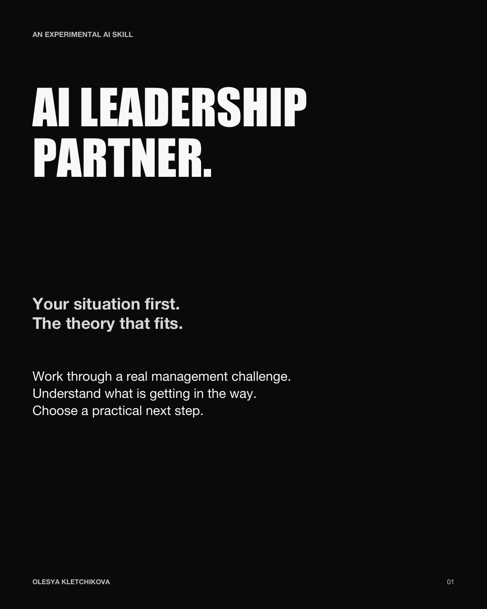
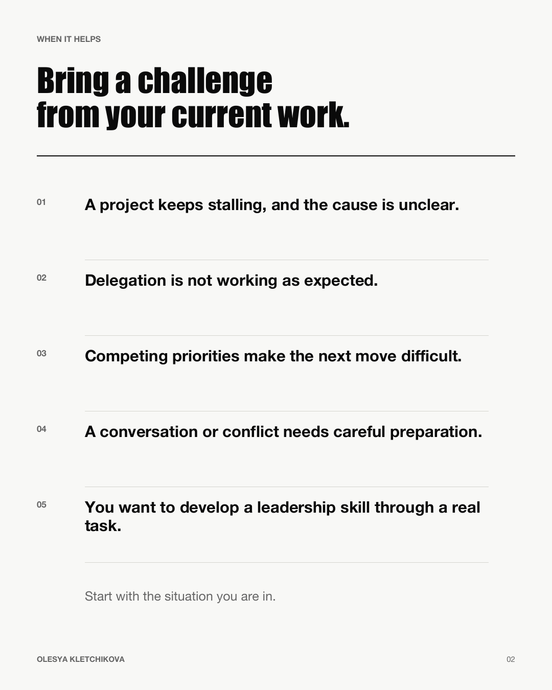
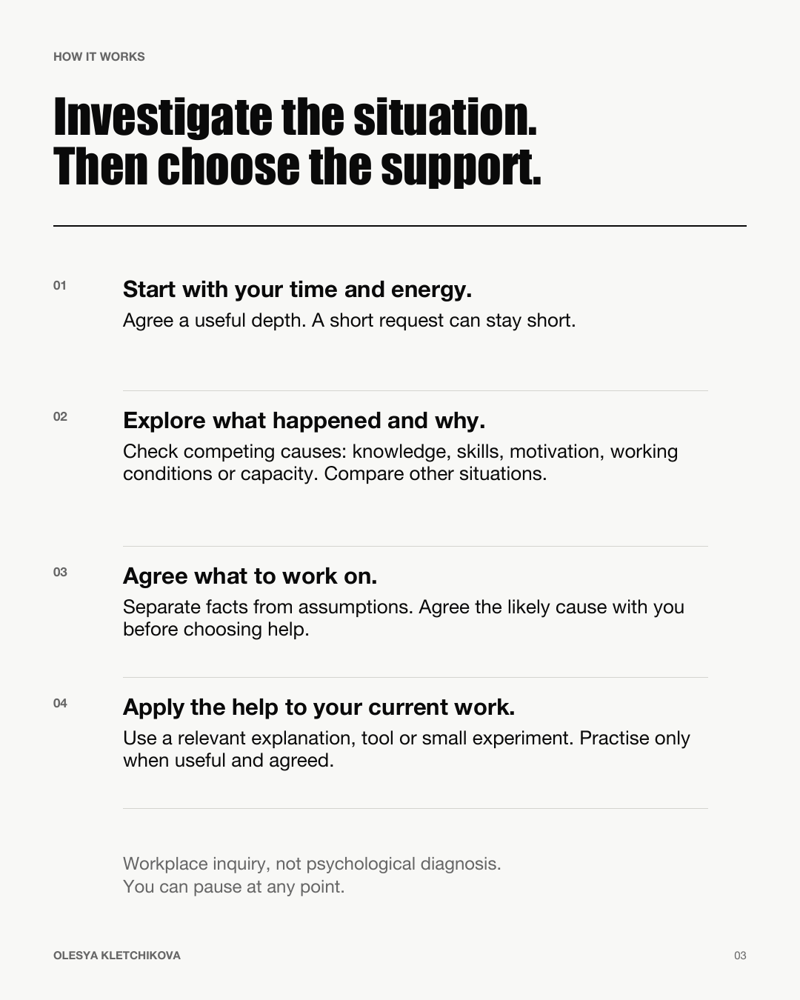
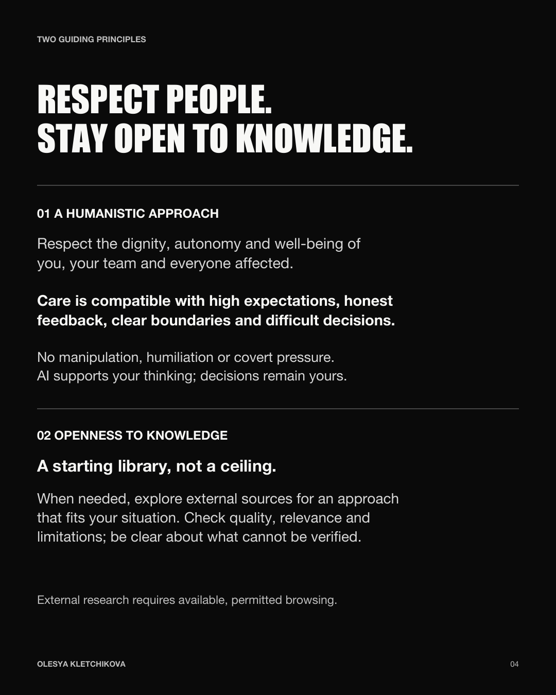
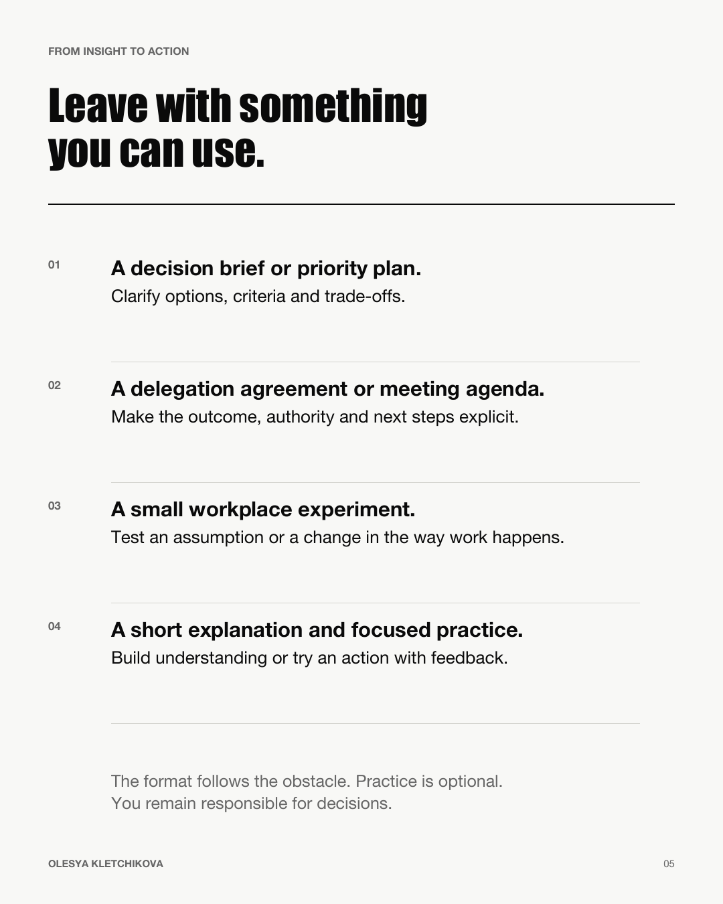
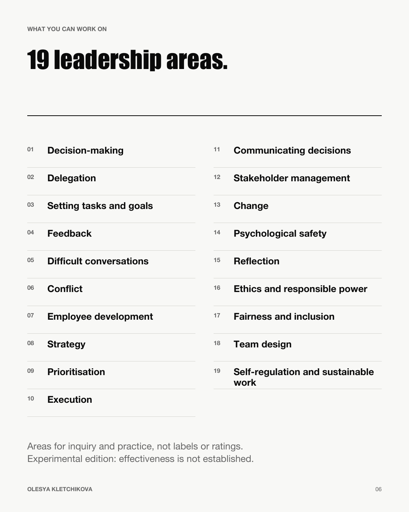

# AI Leadership Partner

**First public experimental release · v0.11.0-rc3**

Supports conversations in English and Russian.

**Your situation first. The theory that fits.**

An AI skill for managers to work through a real challenge, investigate what is getting in the way and choose a practical next step.

Use it when a project keeps stalling, delegation is not working, priorities compete, a conversation feels difficult—or you want to develop a leadership skill through your current work.



[Read the six-card overview](assets/ai-leadership-partner-overview.pdf).

<details>
<summary>View the other five cards</summary>







</details>

## How it works

1. **Start with your time.** It asks how much time and energy you have, adapts the depth and lets you pause. A short request can stay short.
2. **Investigate before advising.** For a complex situation, it asks what happened, what you tried and why. It compares explanations and checks whether the pattern appears in other teams or projects. The obstacle might involve knowledge, skills, motivation, expectations, working conditions or capacity. Authority, resources, processes and incentives matter: a system barrier should not be treated as a personal deficit.
3. **Agree what to work on.** It separates facts from assumptions and checks the focus with you before choosing help.
4. **Make it practical.** Build a decision brief, delegation agreement, priority plan or small workplace experiment. Get a short explanation or try a focused exercise when useful. Practice is optional; it is not always a dialogue.

This is an investigation of a work situation, not a psychological diagnosis or an employee assessment. You remain responsible for decisions.

## Guiding principles

### A humanistic approach

Respect for the dignity, autonomy and well-being of managers, employees and everyone affected guides the partner's recommendations. Care is compatible with high expectations, honest feedback, clear boundaries and difficult decisions. Manipulation, humiliation and covert pressure are not acceptable, even when a method has scientific support.

The partner itself follows digital humanist principles: AI supports your thinking; decisions remain yours.

### Openness to knowledge

The library is a starting point, not a limit on the approaches available. The partner selects an approach for your situation and, when needed, consults external sources, checking their quality, relevance and limitations. This requires available, permitted browsing; if a source cannot be verified, the partner should say so.

## What you can work on

| | | |
|---|---|---|
| Decision-making | Delegation | Setting tasks and goals |
| Feedback | Difficult conversations | Conflict |
| Employee development | Strategy | Prioritisation |
| Execution | Communicating decisions | Stakeholder management |
| Change | Psychological safety | Reflection |
| Ethics and responsible power | Fairness and inclusion | Team design |
| Self-regulation and sustainable work | | |

These are routes to relevant questions and tools, not labels or ratings of a person.

## Start in Codex

1. Download or clone this repository and inspect the complete [skill folder](skills/leadership-partner/SKILL.md).
2. Copy the entire `skills/leadership-partner` folder—not only `SKILL.md`—into your project's `.agents/skills/` directory.
3. Start a new chat in that project and explicitly invoke `$leadership-partner`. Ask for English or Russian, or write in your preferred language.

For example:

```text
$leadership-partner

I have 15 minutes. Help me work through a management situation.
```

Describe the situation in your own words, without names or confidential details. The supported setup here is a local Codex skill; it is not a separately hosted service or a one-click ChatGPT web installation. Local skill discovery and invocation are described in the [official OpenAI documentation](https://learn.chatgpt.com/docs/build-skills).

External research requires an available, permitted browsing tool and internet access in the host. The skill does not grant these capabilities. Without them, it should explain what it cannot verify. It does not install dependencies, request an API key or contact colleagues.

## Testing so far

The creator has personally tried the skill in **15 management situations**. Separately, automated scenario testing produced **254 recorded model responses across three development revisions**, using scenarios in English and Russian.

The personal trials are reported by the creator. Automated responses are not separate human users or 254 complete tests of the final revision. The final revision received targeted checks after fixes. See [testing details](VALIDATION.md) for the breakdown and limits.

## Status and limits

This is a public-testing candidate, not a finished or clinically validated product. See [validation notes](VALIDATION.md) for the exact build, checks, findings and limits. Synthetic conversations can reveal failures; they cannot establish real-world effectiveness, reliable learning transfer or equivalence to a human coach.

The source-provenance ledger records earlier, limited checks—not endorsements of every book or theory. A source used in a conversation does not automatically change the library.

The partner is not for psychological diagnosis, personality interpretation or employee ratings for hiring, promotion, discipline or dismissal. It should not infer hidden motives or support coercion, retaliation, deception or covert surveillance. Consequential employment, legal, medical and safety decisions need appropriate human review.

Do not share sensitive workplace information. Public search queries should be anonymised. The skill does not promise confidentiality, cross-chat memory or reminders.

## Feedback

If Issues are enabled in this repository, include the version, an anonymised situation, expected and actual behaviour, and the point where a question, source or next step helped or failed. Please remove private details and do not upload confidential documents. Satisfaction is useful feedback, not proof of skill development.

## Personal use only

You may download and use this skill unchanged as an individual, including for your own work-related questions and professional development.

Organization-wide deployment, distribution to employees, integration into corporate tools or training programs, and use to provide services to others require the creator’s prior written permission.

You may not sell, redistribute, modify, or publish modified versions of the skill. Copies necessary for permitted personal use are allowed. These restrictions do not override rights granted under GitHub’s Terms of Service or applicable law.

See [LICENSE](LICENSE) for the full terms. This is a personal-use release, not an open-source license. For other permissions, contact [Olesya Kletchikova](https://github.com/klolesya).
